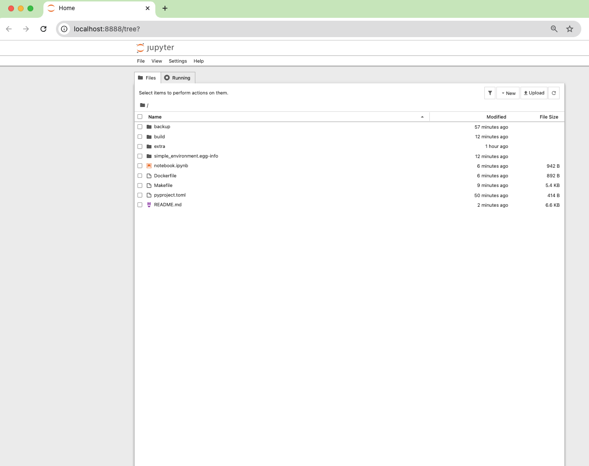

<div align="center">
  <a href="https://www.python.org" target="_blank"></a>
  <a href="https://www.docker.com/" target="_blank"></a>
  <a href="https://jupyter.org/" target="_blank"></a>
</div>

# Reproducible Python 3.11 Development Environment

This repository provides a minimal, reproducible Python **3.11** environment using `pyproject.toml`, a `Makefile`, and **Docker**. It's designed for running a Jupyter Notebook server either locally in a virtual environment or within an isolated, consistent container.


<p align="center">
  
  
  
</p>

---

## What You Get

-   **Two Workflows**: Choose between a local virtual environment (`.venv`) or a fully containerized Docker setup.
-   **Modern Packaging**: Dependencies are managed declaratively with `pyproject.toml`.
-   **Automation**: A powerful `Makefile` simplifies installation, development, testing, and container management.
-   **Cross-Platform**: Instructions are provided for a seamless experience on macOS, Linux, and Windows.




---

## Prerequisites

You have two main options. Choose the one that best fits your workflow.

1.  **For Local Development:**
    * **Python 3.11**
    * **GNU Make** (`make` or `gmake`)
    * A POSIX shell like **bash** (Git Bash is recommended on Windows).

2.  **For Docker (Recommended):**
    * **Docker Desktop** (macOS, Windows) or **Docker Engine** (Linux).
    * **GNU Make** (optional, but recommended for using the `Makefile` shortcuts).

> See the **OS-Specific Setup** section at the bottom for detailed installation instructions.

---

## 🐳 Option 1: Docker Quick Start (Recommended)

Using Docker is the easiest way to get started. It requires no local Python installation and guarantees a perfectly consistent environment across any machine.

1.  **Build the Docker Image**
    This command packages the Python environment and all dependencies into a self-contained image named `simple-env:latest`.
    ```bash
    make build-container
    ```

2.  **Run the Jupyter Container**
    This starts the container, maps port `8888` to your machine, and mounts the current project directory into the container's `/workspace` folder.
    ```bash
    make run-container
    ```

3.  **Access Jupyter Notebook**
    Open your browser and navigate to the URL provided in the terminal output:
    🔗 **http://localhost:8888**

    Any notebooks you create or modify will be saved directly in your local project folder because it's mounted into the container.

### Common Docker Tasks

The `Makefile` provides several commands to manage the container's lifecycle:

-   `make build-container`: Build or rebuild the Docker image.
-   `make run-container`: Start the container in the background.
-   `make logs`: View live logs from the Jupyter server (press `Ctrl-C` to exit).
-   `make stop-container`: Stop the container without removing it.
-   `make remove-container`: Stop and permanently remove the container.

---

## 🐍 Option 2: Local Environment Quick Start

Use this method if you prefer to manage a Python virtual environment directly on your host machine.

1.  **Create Virtual Environment & Install Dependencies**
    This command creates a `.venv` folder and installs the packages defined in `pyproject.toml`.
    ```bash
    make install
    ```
    > **Note:** On macOS with Homebrew, you may need to use `gmake install`. On Windows with Git Bash, use `make install PYTHON="py -3.11"`.

2.  **Activate Environment & Launch Jupyter**
    ```bash
    # Activate on macOS/Linux
    source .venv/bin/activate

    # Activate on Windows (Git Bash)
    source .venv/Scripts/activate

    # Launch the notebook server
    jupyter notebook
    ```

### Common Local Tasks

-   `make dev`: Install in editable mode with development dependencies.
-   `make update`: Upgrade all project dependencies to their latest versions.
-   `make shell`: Open a new shell with the virtual environment already activated.
-   `make clean`: Remove build artifacts and the `.venv` directory.

---

## 🚀 Usage and Customization

### Adding New Packages

To add new libraries like `pandas` or `matplotlib`, follow this process to ensure your environment remains reproducible.

1.  **Update `pyproject.toml`**: Add the new package names to the `dependencies` list.
    ```toml
    # pyproject.toml
    [project]
    # ... other settings
    dependencies = [
      "notebook",
      "ipykernel",
      "pandas",         # <-- Add new package here
      "matplotlib"      # <-- And here
    ]
    ```

2.  **Rebuild Your Environment**:
    * **Docker**: You must rebuild the image to include the new libraries.
        ```bash
        make build-container
        ```
    * **Local**: Simply run the installation command again. It will add the new packages to your `.venv`.
        ```bash
        make install
        ```

### Understanding Data Persistence in Docker

**Your data is safe.** When you run `make run-container`, the command uses a **bind mount** (`-v "$(pwd)":/workspace`) to link your local project folder to the `/workspace` directory inside the container.

* **Analogy**: Think of the container as a temporary office and the bind mount as a magic portal on your desk. Anything you create or modify in the `/workspace` directory (through the portal) is **instantly saved** in your project folder on your actual computer.
* **What is lost?**: Any files created *outside* of the `/workspace` directory will be destroyed when you run `make remove-container`.
* **Bottom Line**: Always save your work inside the `/workspace` folder.

### Using the Docker Image as a Command-Line Tool

You can run commands directly without starting the Jupyter server. This is useful for running scripts or accessing a shell.

* **Run a Python script**:
    The `--rm` flag automatically removes the container after the script finishes.
    ```bash
    docker run --rm -v "$(pwd)":/workspace simple-env:latest python your_script.py
    ```

* **Get an interactive shell inside the container**:
    This is great for debugging or running ad-hoc commands.
    ```bash
    docker run --rm -it -v "$(pwd)":/workspace simple-env:latest bash
    ```

---

## Project Configuration Files

<details>
<summary><strong>Click to expand and view configuration files</strong></summary>

### `pyproject.toml`
This file defines the project metadata and its core dependencies.
```toml
[build-system]
requires = ["setuptools>=64", "wheel"]
build-backend = "setuptools.build_meta"

[project]
name = "simple-environment"
version = "0.1.0"
description = "Minimal environment for Jupyter Notebook (Python 3.11)."
requires-python = ">=3.11,<3.12"
dependencies = [
  "notebook",
  "ipykernel"
]
```

### `Dockerfile`
This file defines the steps to build the containerized environment.
```dockerfile
# syntax=docker/dockerfile:1
FROM python:3.11-slim

# Prevent Python from writing .pyc files and buffer stdout
ENV PYTHONDONTWRITEBYTECODE=1 \
    PYTHONUNBUFFERED=1 \
    PIP_NO_CACHE_DIR=1

# Install system dependencies required for building some Python packages
RUN apt-get update && apt-get install -y --no-install-recommends build-essential && \
    rm -rf /var/lib/apt/lists/*

# Set the working directory for the application code
WORKDIR /opt/app

# Copy project files and install dependencies
COPY . .
RUN python -m pip install --upgrade pip && \
    pip install .

# Set the final working directory for user data and expose the port
WORKDIR /workspace
EXPOSE 8888

# Command to run Jupyter Notebook
CMD ["jupyter", "notebook", "--ip=0.0.0.0", "--no-browser", "--allow-root", "--NotebookApp.token="]
```
</details>

---

## OS-Specific Setup (for Local Environment)

<details>
<summary><strong>Click to expand OS-specific setup instructions</strong></summary>

### macOS

1.  **Install Homebrew, GNU Make, and Python 3.11**
    ```bash
    /bin/bash -c "$(curl -fsSL [https://raw.githubusercontent.com/Homebrew/install/HEAD/install.sh](https://raw.githubusercontent.com/Homebrew/install/HEAD/install.sh))"
    brew install make python@3.11
    ```
    Homebrew installs GNU Make as `gmake`. You must either call `gmake` explicitly or create an alias for `make`:
    ```bash
    echo 'alias make="gmake"' >> ~/.zshrc && source ~/.zshrc
    ```
2.  **Verify Installation**
    ```bash
    gmake --version
    python3.11 --version
    ```

### Linux (Debian/Ubuntu)
```bash
sudo apt update
sudo apt install -y make python3.11 python3.11-venv
make --version
python3.11 --version
```

### Windows
1.  **Install Git for Windows** (provides Git Bash): [https://git-scm.com/download/win](https://git-scm.com/download/win)
2.  **Install Python 3.11**: [https://www.python.org/downloads/windows/](https://www.python.org/downloads/windows/) (ensure you select "Add Python to PATH").
3.  **Install GNU Make** (using an Admin PowerShell):
    * With **Scoop** (recommended): `irm get.scoop.sh | iex` then `scoop install make`
    * Or with **Chocolatey**: `Set-ExecutionPolicy Bypass -Scope Process -Force; [System.Net.ServicePointManager]::SecurityProtocol = [System.Net.ServicePointManager]::SecurityProtocol -bor 3072; iex ((New-Object System.Net.WebClient).DownloadString('https://community.chocolatey.org/install.ps1')); choco install make`
4.  **Run all `make` commands inside Git Bash.** You may need to specify the Python executable:
    ```bash
    make install PYTHON="py -3.11"
    ```
</details>

---

## Troubleshooting

-   **`make: command not found`**: Install GNU Make using the OS-specific instructions. On macOS, remember to use `gmake` or create an alias.
-   **Jupyter can’t see the kernel (local setup)**: Ensure you've activated the virtual environment (`source .venv/bin/activate`) before running `jupyter notebook`.
-   **Permission Denied (Docker on Linux)**: You may need to run Docker commands with `sudo` or [add your user to the `docker` group](https://docs.docker.com/engine/install/linux-postinstall/).

---

## Resetting the Environment

-   **Local Environment**:
    ```bash
    make clean
    ```
-   **Docker Environment**:
    ```bash
    make remove-container
    ```